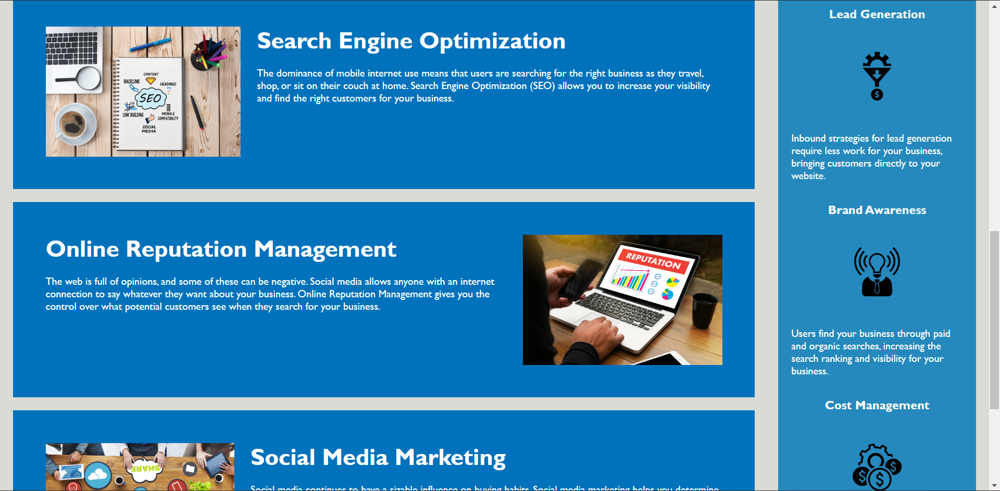

# horiseon-refactor
Hello, this is my refactor project for Horiseon. I have gone through the supplied sample code and made my own changes to better the overall efficiency of the code. I've added more semantic elements for greater browser responsiveness and better accessibility. I made sure there was no more repeating or redundant code to better future-proof the website. The most prominent issues were repeated CSS that could've easily been condensed together if certain elements in the HTML were given the same class attribute.  
Here's a link to the improved website:  https://elijah25.github.io/horiseon-refactor/.

